# Implantação Automatizada do VMware Cloud Foundation em Home Lab


## Observação

Este repositório foi criado a partir da cópia do [repositório](https://github.com/lamw/vcf-automated-lab-deployment) do William Lam, então todos os créditos pertencem a ele.
Eu realizei ajustes de acordo com as minhas necessidades, bem como ajustei e traduzi o conteúdo do README para facilitar o entendimento daqueles que possuem dificuldades no idioma Inglês.

## Descrição

Este script torna muito fácil para qualquer pessoa implantar um VMware Cloud Foundation (VCF) "básico" em um ambiente de laboratório nested para fins de aprendizado e educação. Todos os componentes VMware necessários (VMs do ESXi e Cloud Builder) são automaticamente implantados e configurados para permitir que o VCF seja implantado e configurado usando o VMware Cloud Builder. Para mais informações, você pode consultar a documentação oficial do [VMware Cloud Foundation](https://docs.vmware.com/en/VMware-Cloud-Foundation/index.html).

Abaixo está um diagrama do que é implantado como parte da solução, e você só precisa ter um ambiente vSphere existente rodando, gerenciado pelo vCenter Server e com recursos suficientes (CPU, Memória e Armazenamento) para implantar este laboratório "nested". Para habilitação do VCF (operação pós-implantação), consulte a seção [Execução de Exemplo](#sample-execution) abaixo.

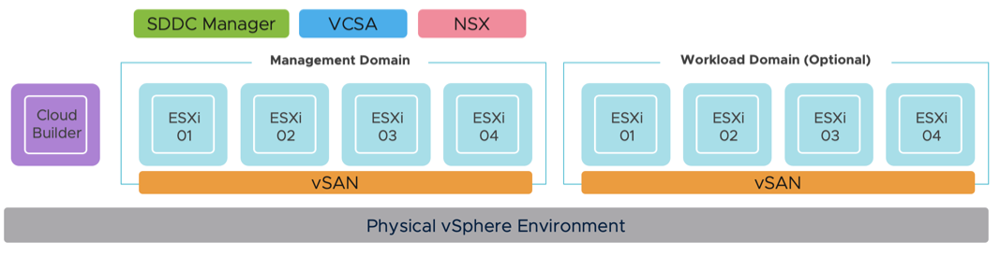

## Changelog
* **07/10/2024**
  * Management Domain:
    * Adiciona suporte para VCF 5.2 (senha para o Cloud Builder 5.2 deve ter no mínimo 15 caracteres)
  * Workload Domain:
    * Adiciona suporte para VCF 5.2
    * Adiciona variável `$SeparateNSXSwitch` para especificar um VDS separado para o NSX (similar à opção do Management Domain)
* **28/05/2024**
  * Management Domain:
    * Reorganiza a geração do JSON do Management Domain do VCF para ser mais dinâmica
    * Reorganiza o código de licenciamento para suportar tanto chaves licenciadas quanto a funcionalidade de licenciamento posterior
    * Adiciona `clusterImageEnabled` ao JSON por padrão usando a variável `$EnableVCLM`
  * Workload Domain:
    * Adiciona variável `$EnableVCLM` para controlar a imagem baseada em vLCM para o Cluster do vSphere
    * Adiciona variável `$VLCMImageName` para especificar a imagem baseada em vLCM desejada (por padrão usa o Management Domain)
    * Adiciona variável `$EnableVSANESA` para especificar se o vSAN ESA está habilitado
    * Adiciona variável `$NestedESXiWLDVSANESA` para especificar se a VM ESXi Nested para WLD será usada para vSAN ESA, requerendo um controlador NVME ao invés de um controlador PVSCSI (padrão)
    * Reorganiza o código de licenciamento para suportar tanto chaves licenciadas quanto a funcionalidade de licenciamento posterior
* **27/03/2024**
  * Adiciona suporte para licenciamento posterior (também conhecido como modo de avaliação de 60 dias)
* **08/02/2024**
  * Adiciona script suplementar `vcf-automated-workload-domain-deployment.ps1` para automatizar a implantação do Workload Domain
* **05/02/2024**
  * Melhora o código de substituição para redes CIDR de ESXi vMotion, vSAN & NSX
  * Renomeia variáveis (`$CloudbuilderVMName`,`$CloudbuilderHostname`,`$SddcManagerName`,`$NSXManagerVIPName`,`$NSXManagerNode1Name`) para (`$CloudbuilderVMHostname`,`$CloudbuilderFQDN`,`$SddcManagerHostname`,`$NSXManagerVIPHostname`,`$NSXManagerNode1Hostname`) para representar melhor o valor esperado (Hostname e FQDN)
* **03/02/2024**
  * Adiciona suporte para definir recursos (CPU, memória e armazenamento) de forma independente para VMs ESXi Nested para uso com Domínios de Gerenciamento e/ou Workload
  * Gera automaticamente o arquivo JSON de comissão de hosts do Workload Domain do VCF (vcf-commission-host-api.json) para uso com a API do SDDC Manager (a interface agora incluirá `-ui` no nome do arquivo)
* **29/01/2024**
  * Adiciona suporte para [VCF 5.1]([texto](https://blogs.vmware.com/cloud-foundation/2023/11/07/announcing-availability-of-vmware-cloud-foundation-5-1/))
  * Inicia automaticamente a criação do Management Domain do VCF no SDDC Manager usando o arquivo JSON de implantação gerado (vcf-mgmt.json)
  * Adiciona suporte para implantar hosts ESXi Nested para Workload Domain
  * Gera automaticamente o arquivo JSON de comissão de hosts do Workload Domain do VCF (vcf-commission-host.json) para o SDDC Manager
  * Adiciona argumento `-CoresPerSocket` para otimizar a implantação de ESXi Nested para licenciamento
  * Adiciona variáveis (`$NestedESXivMotionNetworkCidr`, `$NestedESXivSANNetworkCidr` e `$NestedESXiNSXTepNetworkCidr`) para personalizar os CIDRs das redes vMotion, vSAN e NSX TEP do ESXi

* **27/03/2023**
  * Habilita múltiplas implantações no mesmo Cluster

* **28/02/2023**
  * Adiciona nota sobre Cluster habilitado com DRS para criação de vApp e pré-checagem no código

* **21/02/2023**
  * Adiciona nota à Configuração para implantar o Management Domain do VCF usando apenas um único host ESXi

* **09/02/2023**
  * Atualiza a memória do ESXi para corrigir falhas nas tarefas "Configurar o Transport Node do NSX-T Data Center" e "Reconfigurar a Alta Disponibilidade do vSphere" aumentando a memória do ESXi para 46GB [explicado aqui](http://strivevirtually.net)

* **21/01/2023**
  * Adiciona suporte para [VCF 4.5](https://imthiyaz.cloud/automated-vcf-deployment-script-with-nested-esxi)
  * Corrige o tamanho do disco de boot do vSAN
  * Siga [KB 89990](https://kb.vmware.com/s/article/89990) se você receber "O endereço IP do gateway para o gerenciamento não é contatável"
  * Se falhar a criação do Diskgroup do VSAN, siga [FakeSCSIReservations](https://williamlam.com/2013/11/how-to-run-nested-esxi-on-top-of-vsan.html)

* **25/05/2021**
  * Lançamento Inicial

## Requisitos

* Versões suportadas do VCF e os materiais necessários (BOM)

| Versão VCF | Download do Cloud Builder                                                                                                                                                                                                                     | Download do ESXi Nested                                                       |
|-------------|--------------------------------------------------------------------------------------------------------------------------------------------------------------------------------------------------------------------------------------------|----------------------------------------------------------------------------|
| 5.2         | [VMware Cloud Builder 5.2 (23480823) OVA](https://support.broadcom.com/group/ecx/productfiles?subFamily=VMware%20Cloud%20Foundation&displayGroup=VMware%20Cloud%20Foundation%205.2&release=5.2&os=&servicePk=520823&language=EN)     | [Nested ESXi 8.0 Update 3 OVA](https://community.broadcom.com/flings)  |
| 5.1.1       | [VMware Cloud Builder 5.1.1 (23480823) OVA](https://support.broadcom.com/group/ecx/productfiles?subFamily=VMware%20Cloud%20Foundation&displayGroup=VMware%20Cloud%20Foundation%205.1&release=5.1.1&os=&servicePk=208634&language=EN) | [Nested ESXi 8.0 Update 2b OVA](https://community.broadcom.com/flings) |
| 5.1         | [VMware Cloud Builder 5.1 (22688368) OVA](https://support.broadcom.com/group/ecx/productfiles?subFamily=VMware%20Cloud%20Foundation&displayGroup=VMware%20Cloud%20Foundation%205.1&release=5.1&os=&servicePk=203383&language=EN)         | [Nested ESXi 8.0 Update 2 OVA](https://community.broadcom.com/flings)  |

* Servidor vCenter rodando pelo menos vSphere 7.0 ou posterior
    * Se o seu armazenamento físico for vSAN, certifique-se de que você aplicou a seguinte configuração mencionada [aqui](https://www.williamlam.com/2013/11/how-to-run-nested-esxi-on-top-of-vsan.html)
* Rede do ESXi
  * Habilite [MAC Learning](https://williamlam.com/2018/04/native-mac-learning-in-vsphere-6-7-removes-the-need-for-promiscuous-mode-for-nested-esxi.html) ou [Modo Promíscuo](https://kb.vmware.com/kb/1004099) na rede do seu host ESXi físico para garantir a conectividade de rede adequada para cargas de trabalho ESXi Nested
* Requisitos de Recursos
    * Computação
        * Capacidade de provisionar VMs com até 8 vCPUs (12 vCPUs necessárias para implantação do Workload Domain)
        * Capacidade de provisionar até 384 GB de memória
        * Cluster habilitado com DRS (não obrigatório, mas a criação de vApps não será possível)
    * Rede
        * 1 x Portgroup Padrão ou Distribuído (roteável) para implantar todas as VMs (VCSA, NSX-T Manager & NSX-T Edge)
           * 13 x Endereços IP para Cloud Builder, SDDC Manager, VCSA, ESXi e VMs NSX-T
           * 9 x Endereços IP para implantação do Workload Domain (se aplicável) para ESXi, NSX e VCSA
    * Armazenamento
        * Capacidade de provisionar até 1,25 TB de armazenamento

        **Nota:** Para requisitos detalhados, consulte a planilha de planejamento e preparação [aqui](https://docs.vmware.com/en/VMware-Cloud-Foundation/5.2/vcf-planning-and-preparation-workbook.zip)
* Licenças do VMware Cloud Foundation 5.x para vCenter, ESXi, vSAN e NSX-T (VCF 5.1.1 ou posterior suporta a funcionalidade [Licenciar Depois](https://williamlam.com/2024/03/enabling-license-later-evaluation-mode-for-vmware-cloud-foundation-vcf-5-1-1.html), portanto, as chaves de licença agora são opcionais)
* Desktop (Windows, Mac ou Linux) com o PowerShell Core mais recente e PowerCLI 12.1 Core instalado. Veja [instruções aqui](https://blogs.vmware.com/PowerCLI/2018/03/installing-powercli-10-0-0-macos.html) para mais detalhes

## Configuração

Antes de executar o script, você precisará editá-lo e atualizar várias variáveis para corresponder ao seu ambiente de implantação. Os detalhes de cada seção são descritos abaixo, incluindo os valores reais usados no meu ambiente de home lab.

Esta seção descreve as credenciais do seu vCenter Server físico onde o ambiente do laboratório VCF será implantado:
```console
$VIServer = "FILL-ME-IN"
$VIUsername = "FILL-ME-IN"
$VIPassword = "FILL-ME-IN"
```

Esta seção descreve a localização dos arquivos necessários para a implantação.
```console
$NestedESXiApplianceOVA = "C:\Temp\Nested_ESXi8.0u3_Appliance_Template_v1.ova"
$CloudBuilderOVA = "C:\Temp\VMware-Cloud-Builder-5.2.0.0-24108943_OVF10.ova"
```

Esta seção define as licenças para cada componente dentro do VCF. Se você deseja usar o modo de avaliação de 60 dias, pode deixar esses campos em branco, mas precisa usar o VCF 5.1.1 ou posterior.
```console
$VCSALicense = ""
$ESXILicense = ""
$VSANLicense = ""
$NSXLicense = ""
```

Esta seção define as configurações do VCF, incluindo o nome dos arquivos de saída para implantar o Management Domain do VCF, juntamente com hosts ESXi adicionais para comissionar para uso com a interface do SDDC Manager ou API para implantação do Workload Domain do VCF. Os valores padrão são suficientes.
```console
$VCFManagementDomainPoolName = "vcf-m01-rp01"
$VCFManagementDomainJSONFile = "vcf-mgmt.json"
$VCFWorkloadDomainUIJSONFile = "vcf-commission-host-ui.json"
$VCFWorkloadDomainAPIJSONFile = "vcf-commission-host-api.json"
```

Esta seção descreve a configuração para o appliance virtual VMware Cloud Builder:
```console
$CloudbuilderVMHostname = "vcf-m01-cb01"
$CloudbuilderFQDN = "vcf-m01-cb01.vmbeer.local"
$CloudbuilderIP = "192.168.68.2"
$CloudbuilderAdminUsername = "admin"
$CloudbuilderAdminPassword = "VMw@re123!VMw@re123!"
$CloudbuilderRootPassword = "VMw@re123!VMw@re123!"
```

Esta seção descreve a configuração que será usada para implantar o SDDC Manager dentro do ambiente ESXi Nested:
```console
$SddcManagerHostname = "vcf-m01-sddcm01"
$SddcManagerIP = "192.168.68.3"
$SddcManagerVcfPassword = "VMware1!VMware1!"
$SddcManagerRootPassword = "VMware1!VMware1!"
$SddcManagerRestPassword = "VMware1!VMware1!"
$SddcManagerLocalPassword = "VMware1!VMware1!"
```

Esta seção define o número de VMs ESXi Nested a serem implantadas, juntamente com seus endereços IP associados. Os nomes são os nomes de exibição das VMs quando implantadas, e você deve garantir que esses nomes sejam adicionados à sua infraestrutura DNS. Um mínimo de quatro hosts é necessário para a implantação adequada do VCF.
```console
$NestedESXiHostnameToIPsForManagementDomain = @{
    "vcf-m01-esx01"   = "192.168.68.7"
    "vcf-m01-esx02"   = "192.168.68.8"
    "vcf-m01-esx03"   = "192.168.68.9"
    "vcf-m01-esx04"   = "192.168.68.10"
}
```

Esta seção define o número de VMs ESXi Nested a serem implantadas, juntamente com seus endereços IP associados para uso em uma implantação de Workload Domain. Os nomes são os nomes de exibição das VMs quando implantadas, e você deve garantir que esses nomes sejam adicionados à sua infraestrutura DNS. Um mínimo de quatro hosts deve ser usado para a implantação do Workload Domain.
```console
$NestedESXiHostnameToIPsForWorkloadDomain = @{
    "vcf-m01-esx05"   = "192.168.68.11"
    "vcf-m01-esx06"   = "192.168.68.12"
    "vcf-m01-esx07"   = "192.168.68.13"
    "vcf-m01-esx08"   = "192.168.68.14"
}
```

**Nota:** Um Management Domain do VCF pode ser implantado com apenas uma única VM ESXi Nested. Para mais detalhes, consulte este [post no blog](https://williamlam.com/2023/02/vmware-cloud-foundation-with-a-single-esxi-host-for-management-domain.html) para os ajustes necessários.

Esta seção descreve a quantidade de recursos a serem alocados para as VMs ESXi Nested, tanto para o Management Domain quanto para o Workload Domain (caso você opte por implantá-lo). Dependendo do seu uso, você pode querer aumentar os recursos, mas para a funcionalidade adequada, este é o mínimo necessário para começar. Para a configuração de Memória e Disco, a unidade é em GB.
```console
# Nested ESXi VM Resources for Management Domain
$NestedESXiMGMTvCPU = "12"
$NestedESXiMGMTvMEM = "78" #GB
$NestedESXiMGMTCachingvDisk = "4" #GB
$NestedESXiMGMTCapacityvDisk = "200" #GB
$NestedESXiMGMTBootDisk = "32" #GB

# Nested ESXi VM Resources for Workload Domain
$NestedESXiWLDVSANESA = $false
$NestedESXiWLDvCPU = "8"
$NestedESXiWLDvMEM = "36" #GB
$NestedESXiWLDCachingvDisk = "4" #GB
$NestedESXiWLDCapacityvDisk = "250" #GB
$NestedESXiWLDBootDisk = "32" #GB
```

Esta seção descreve as Redes ESXi Nested que serão usadas para a configuração do VCF. Para a rede de gerenciamento do ESXi, a definição CIDR deve corresponder à rede especificada na variável `$VMNetwork`.
```console
$NestedESXiManagementNetworkCidr = "192.168.68.0/24"
$NestedESXivMotionNetworkCidr = "172.17.32.0/24"
$NestedESXivSANNetworkCidr = "172.17.33.0/24"
$NestedESXiNSXTepNetworkCidr = "172.17.34.0/24"
```

Esta seção descreve as configurações que serão usadas para implantar o VCSA dentro do ambiente ESXi Nested:
```console
$VCSAName = "vcf-m01-vc01"
$VCSAIP = "192.168.68.4"
$VCSARootPassword = "VMware1!"
$VCSASSOPassword = "VMware1!"
$EnableVCLM = $true
```

Esta seção descreve as configurações que serão usadas para implantar a infraestrutura NSX-T dentro do ambiente ESXi Nested:
```console
$NSXManagerVIPHostname = "vcf-m01-nsx01"
$NSXManagerVIPIP = "192.168.68.5"
$NSXManagerNode1Hostname = "vcf-m01-nsx01a"
$NSXManagerNode1IP = "192.168.68.6"
$NSXRootPassword = "VMware1!VMware1!"
$NSXAdminPassword = "VMware1!VMware1!"
$NSXAuditPassword = "VMware1!VMware1!"
```

Esta seção descreve a localização, bem como as configurações de rede genéricas aplicadas às VMs ESXi Nested e Cloud Builder:

```console
$VMDatacenter = "VMB-DATACENTER"
$VMCluster = "VMB-CLUSTER"
$VMNetwork = "PG-MANAGEMENT"
$VMDatastore = "vsanDatastore"
$VMNetmask = "255.255.255.0"
$VMGateway = "192.168.68.1"
$VMDNS = "192.168.68.145"
$VMNTP = "192.168.68.145"
$VMPassword = "VMware1!"
$VMDomain = "vmbeer.local"
$VMSyslog = "192.168.68.4"
$VMFolder = "VCF"
```

> **Nota:** É recomendável que você use um servidor NTP que tenha resolução direta e reversa de DNS configurada. Caso isso não seja feito, durante a fase de validação de pré-requisitos do JSON do VCF, pode levar mais tempo do que o esperado para que o tempo limite do DNS seja concluído antes de permitir que o usuário continue com a implantação do VCF.

Depois de salvar suas alterações, você pode agora executar o script PowerCLI como faria normalmente.

## Log

Há um log adicional detalhado que é gerado como um arquivo de log no seu diretório de trabalho atual **vcf-lab-deployment.log**

## Execução de Exemplo

No exemplo abaixo, estarei utilizando uma VLAN /24 (172.17.31/0/24). A primeira rede será usada para provisionar todas as VMs e colocá-las sob a configuração típica da rede de Gerenciamento do vSphere, e 5 IPs serão alocados desta faixa para o Supervisor Control Plane e 8 IPs para o NSX ALB Service Engine. A segunda rede combinará ambas as faixas de IP para a função NSX ALB VIP/Frontend, bem como as faixas de IP para Workloads. Veja a tabela abaixo para os mapeamentos de rede explícitos, e espera-se que você tenha uma configuração semelhante ao que foi descrito.

|           Hostname          | IP Address    | Function       |
|:---------------------------:|---------------|----------------|
| vcf-m01-cb01.vmbeer.local    | 192.168.68.2 | Cloud Builder  |
| vcf-m01-sddcm01.vmbeer.local | 192.168.68.3 | SDDC Manager   |
| vcf-m01-vc01.vmbeer.local    | 192.168.68.4 | vCenter Server |
| vcf-m01-nsx01.vmbeer.local   | 192.168.68.5 | NSX-T VIP      |
| vcf-m01-nsx01a.vmbeer.local  | 192.168.68.6 | NSX-T Node 1   |
| vcf-m01-esx01.vmbeer.local   | 192.168.68.7 | ESXi Host 1    |
| vcf-m01-esx02.vmbeer.local   | 192.168.68.8 | ESXi Host 2    |
| vcf-m01-esx03.vmbeer.local   | 192.168.68.9 | ESXi Host 3    |
| vcf-m01-esx04.vmbeer.local   | 192.168.68.10 | ESXi Host 4    |
| vcf-m01-esx05.vmbeer.local   | 192.168.68.11 | ESXi Host 5    |
| vcf-m01-esx06.vmbeer.local   | 192.168.68.12 | ESXi Host 6    |
| vcf-m01-esx07.vmbeer.local   | 192.168.68.13 | ESXi Host 7    |
| vcf-m01-esx08.vmbeer.local   | 192.168.68.14 | ESXi Host 8    |


### Script de Implantação do Lab

Aqui está uma captura de tela da execução do script se todos os pré-requisitos básicos tiverem sido atendidos e a mensagem de confirmação antes de iniciar a implantação:

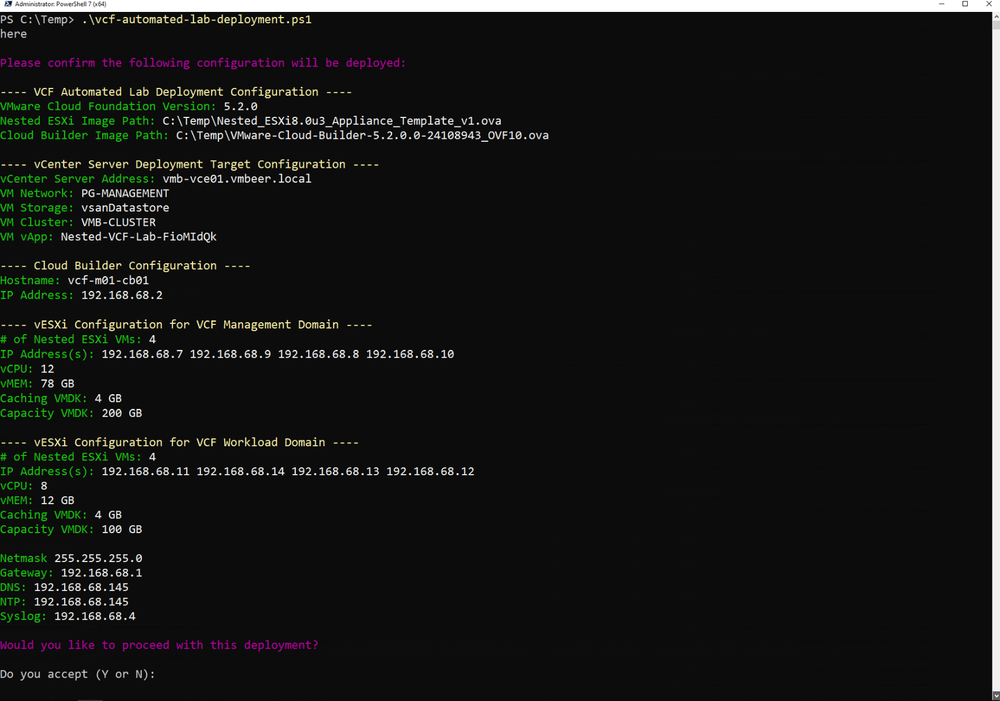

Aqui está um exemplo de saída de uma implantação completa:

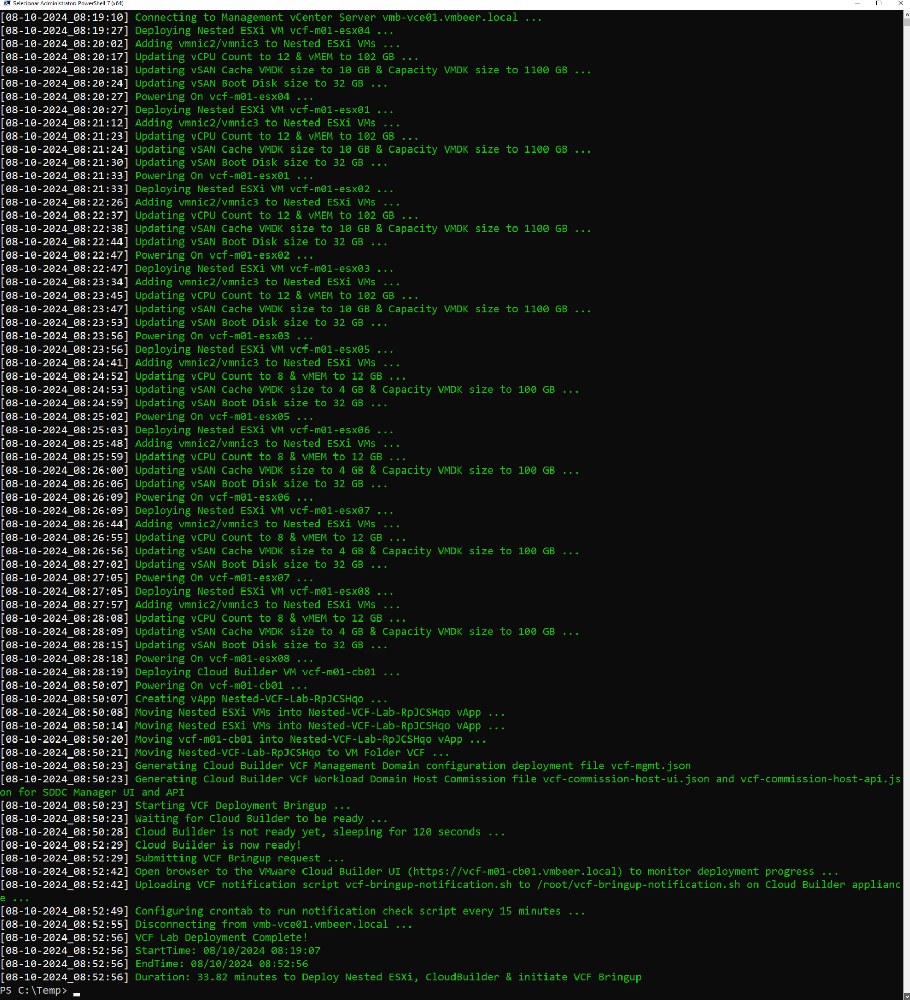

**Nota:** O tempo de implantação pode variar com base nos recursos da infraestrutura física subjacente. No meu lab, isso levou cerca de 19 minutos para ser concluído.

Uma vez concluído, você terminará com oito VMs ESXi Nested e VMs do VMware Cloud Builder, que são colocadas em um vApp.

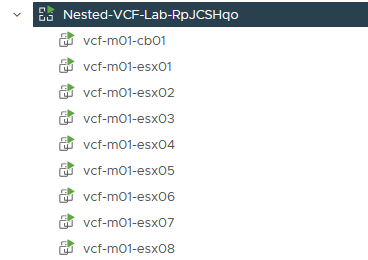

### Implantar Management Domain do VCF

Por padrão, o script gerará automaticamente o arquivo de implantação necessário para o Management Domain do VCF, `vcf-mgmt.json`, com base na sua implantação específica e o salvará no diretório de trabalho atual. Além disso, o arquivo de implantação do VCF será automaticamente enviado ao SDDC Manager e o processo de Bringup do VCF será iniciado, o que em versões anteriores deste script era feito manualmente pelo usuário final.

Agora, você pode simplesmente abrir um navegador da web na sua implantação do SDDC Manager e monitorar o progresso do Bringup do VCF.

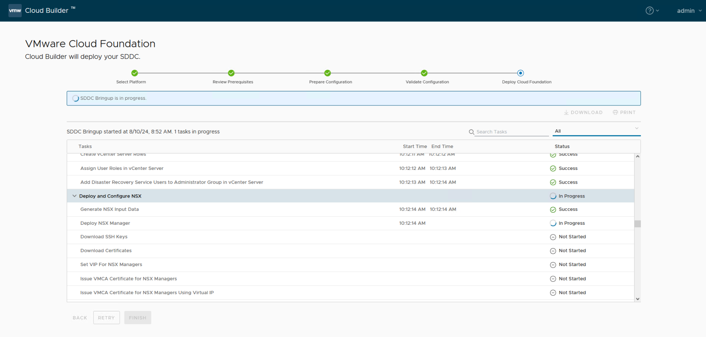

**Nota:** Se você deseja desabilitar o processo de Bringup do VCF, basta procurar a variável chamada `$startVCFBringup` no script e alterar o valor para 0.

A implantação e a configuração podem levar várias horas para serem concluídas, dependendo dos recursos do seu hardware subjacente. Neste exemplo, a implantação levou cerca de 1,5 hora para ser concluída, e você deve ver uma mensagem de sucesso como mostrado abaixo.

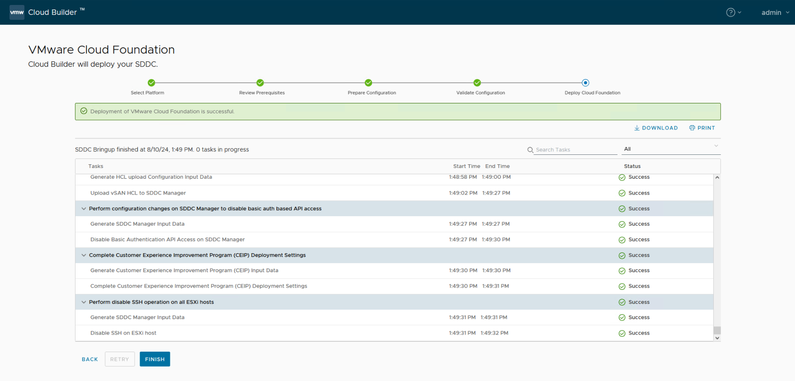

Clique no botão Concluir, o que deverá solicitar que você faça login no SDDC Manager. Você precisará usar as credenciais `administrator@vsphere.local` que você configurou dentro do script de implantação para o vCenter Server implantado.

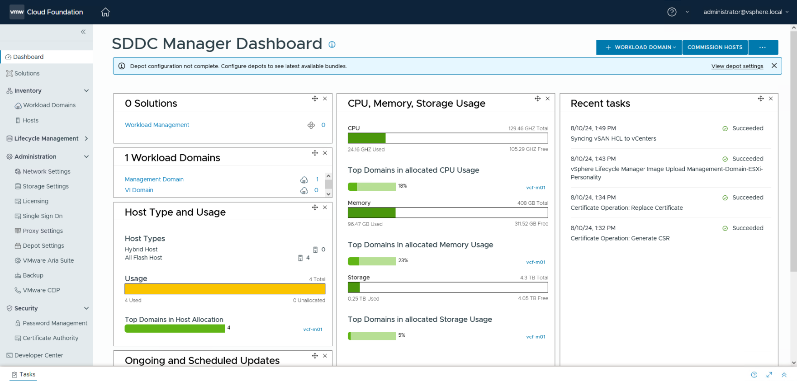


### Deploy VCF Workload Domain

## Método Manual

Por padrão, o script gerará automaticamente o arquivo de comissão de hosts do Workload Domain do VCF, `vcf-commission-host-ui.json`, com base na sua implantação específica e o salvará no diretório de trabalho atual.

Uma vez que o Management Domain do VCF tenha sido implantado, você pode fazer login na interface do SDDC Manager e, em `Inventory->Hosts`, clicar no botão `COMMISSION HOSTS` e fazer o upload do arquivo de configuração JSON gerado.

**Nota:** Atualmente, existe um esquema JSON diferente entre a interface do SDDC Manager e a API para a comissão de hosts, e o arquivo JSON gerado só pode ser usado pela interface do SDDC Manager. Para a API, você precisará fazer algumas alterações no arquivo, incluindo substituir o `networkPoolName` pelo `networkPoolId` correto. Para mais detalhes, consulte o formato JSON na [API de Comissão de Hosts do VCF](https://developer.vmware.com/apis/vcf/latest/v1/hosts/post/).

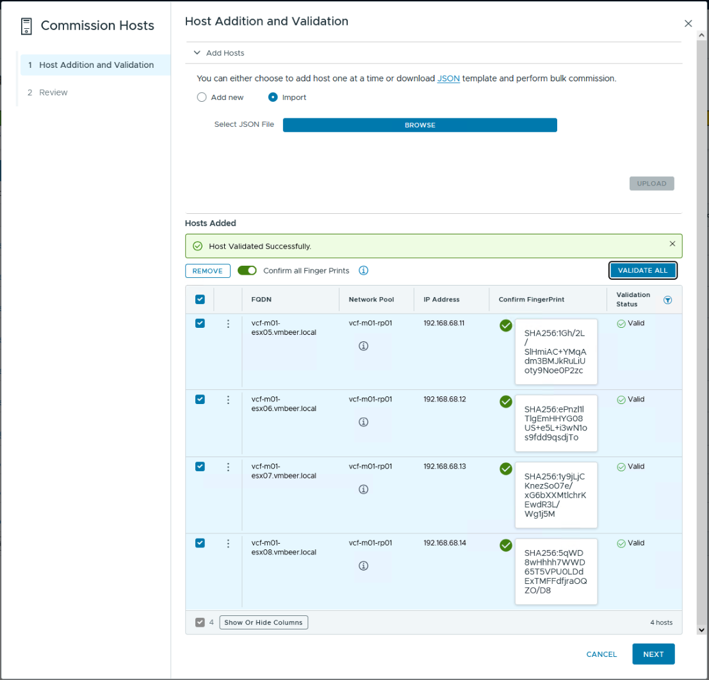

Uma vez que os hosts ESXi tenham sido adicionados ao SDDC Manager, você poderá realizar uma implantação manual do Workload Domain do VCF usando a interface do SDDC Manager ou a API.

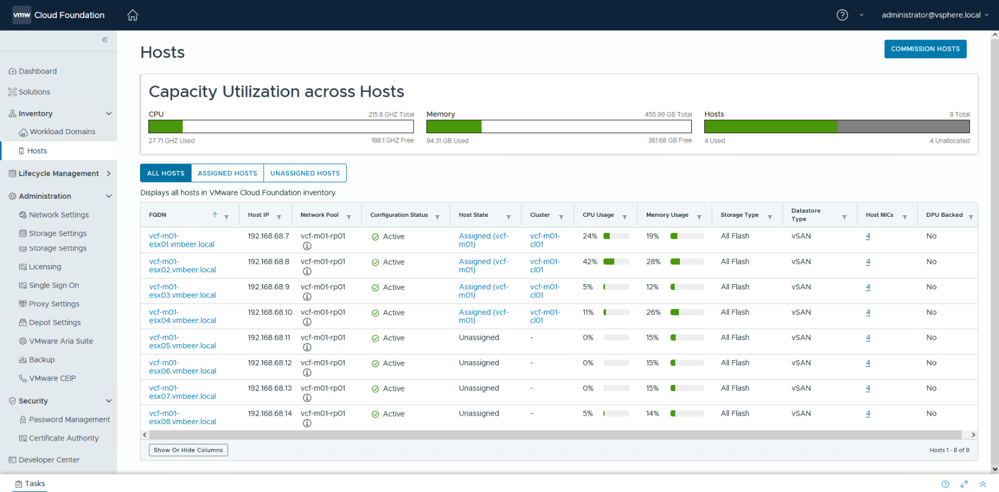

## Método Automatizado

Um script de automação suplementar, `vcf-automated-workload-domain-deployment.ps1`, será usado para configurar automaticamente o Workload Domain. Ele assumirá que o arquivo de comissão de hosts do Workload Domain do VCF, `vcf-commission-host-api.json`, foi gerado a partir da execução do script de implantação inicial, e este arquivo conterá um campo "TBD" porque a API do SDDC Manager espera o ID do Pool de Rede do Management Domain, que será recuperado automaticamente como parte do uso da automação adicional.

Aqui está um exemplo do que será implantado como parte da criação do Workload Domain:

|           Hostname          | IP Address    | Function       |
|:---------------------------:|---------------|----------------|
| vcf-w01-vc01.vmbeer.local    | 192.168.68.15 | vCenter Server |
| vcf-w01-nsx01.vmbeer.local   | 192.168.68.16 | NSX-T VIP      |
| vcf-w01-nsx01a.vmbeer.local  | 192.168.68.17 | NSX-T Node 1   |
| vcf-w01-nsx01b.vmbeer.local  | 192.168.68.18 | NSX-T Node 2   |
| vcf-w01-nsx01c.vmbeer.local  | 192.168.68.19 | NSX-T Node 3   |


### Configuração

Esta seção descreve as credenciais do seu SDDC Manager implantado a partir da configuração do Management Domain:
```console
$sddcManagerFQDN = "FILL_ME_IN"
$sddcManagerUsername = "FILL_ME_IN"
$sddcManagerPassword = "FILL_ME_IN"
```

Esta seção define as licenças para cada componente dentro do VCF
```console
$ESXILicense = "FILL_ME_IN"
$VSANLicense = "FILL_ME_IN"
$NSXLicense = "FILL_ME_IN"
```

Esta seção define as configurações do Management Domain e do Workload Domain, onde os valores padrão devem ser suficientes, a menos que você tenha modificado algo no script de implantação original.
```console
$VCFManagementDomainPoolName = "vcf-m01-rp01"
$VCFWorkloadDomainAPIJSONFile = "vcf-commission-host-api.json"
$VCFWorkloadDomainName = "wld-w01"
$VCFWorkloadDomainOrgName = "vcf-w01"
$EnableVCLM = $true
$VLCMImageName = "Management-Domain-ESXi-Personality"
$EnableVSANESA = $false
```

> **Nota:** Se você for implantar o Workload Domain do VCF com o vLCM habilitado, certifique-se de que o nome `$VLCMImageName` corresponda ao que você vê no SDDC Manager em Lifecycle Management->Image Management. No VCF 5.2, o nome padrão deve ser "Management-Domain-ESXi-Personality", e no VCF 5.1.x, o nome padrão deve ser "Management-Domain-Personality", mas é melhor confirmar antes de prosseguir com a implantação.

Esta seção define a configuração do vCenter Server que será usada no Workload Domain.
```console
$VCSAHostname = "vcf-w01-vc01"
$VCSAIP = "172.17.31.120"
$VCSARootPassword = "VMware1!"
```

Esta seção define as configurações do NSX Manager que serão usadas no Workload Domain.
```console
$NSXManagerVIPHostname = "vcf-w01-nsx01"
$NSXManagerVIPIP = "192.168.68.16"
$NSXManagerNode1Hostname = "vcf-m01-nsx01a"
$NSXManagerNode1IP = "192.168.68.17"
$NSXManagerNode2Hostname = "vcf-m01-nsx01b"
$NSXManagerNode2IP = "192.168.68.18"
$NSXManagerNode3Hostname = "vcf-m01-nsx01c"
$NSXManagerNode3IP = "192.168.68.19"
$NSXAdminPassword = "VMware1!VMware1!"
$SeparateNSXSwitch = $false
```

Esta seção define as informações básicas de rede que serão necessárias para implantar os componentes do vCenter e do NSX.
```console
$VMNetmask = "255.255.255.0"
$VMGateway = "192.168.68.1"
$VMDomain = "vmbeer.local"
```

### Exemplo de Implantação

Aqui está uma captura de tela da execução do script se todos os pré-requisitos básicos tiverem sido atendidos e a mensagem de confirmação antes de iniciar a implantação:

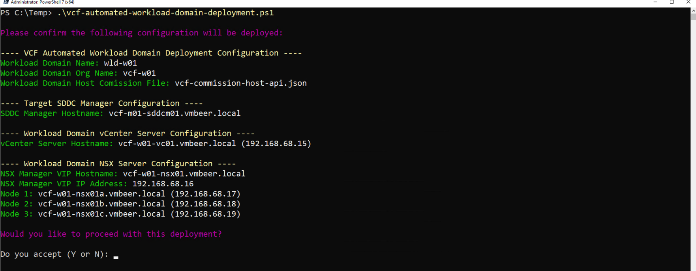

Aqui está um exemplo de saída de uma implantação concluída:

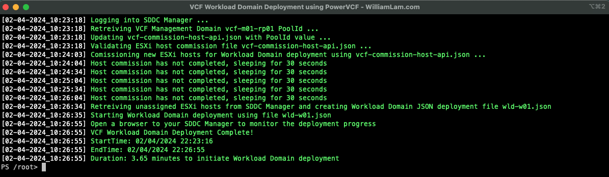

**Nota:** Embora o script deva ser concluído em cerca de 3-4 minutos, a criação real do Workload Domain levará um pouco mais de tempo e dependerá dos seus recursos.

Para monitorar o progresso da implantação do seu Workload Domain, faça login na interface do SDDC Manager.

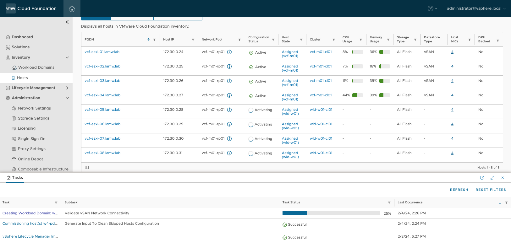

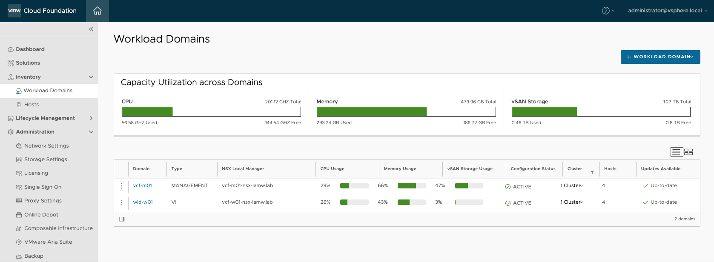

Se você agora fizer login na interface do vSphere para o seu Management Domain, deverá ver o seguinte inventário:

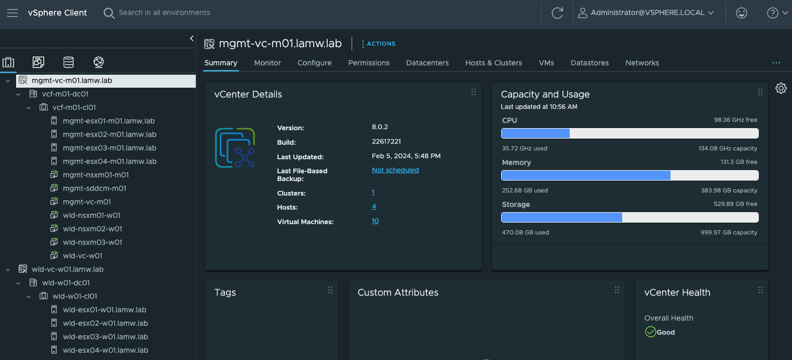

